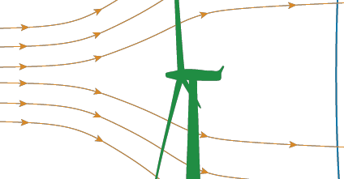
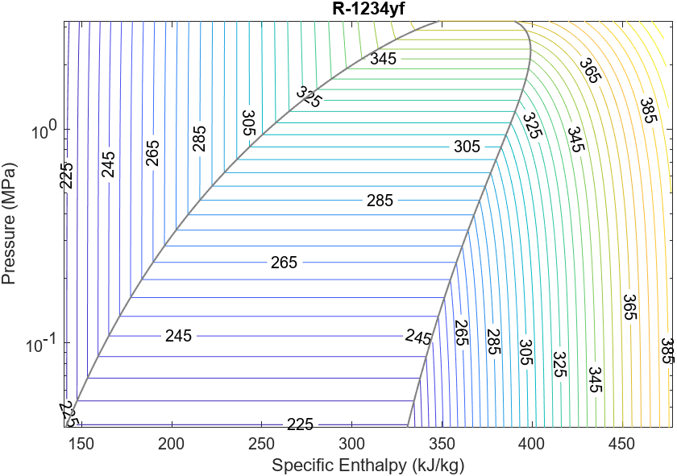

# Fluid Mechanics

 or 

**Curriculum Module**

_Created with R2022b. Compatible with R2022b and later releases._

# Information

This curriculum module contains interactive [MATLAB® live scripts](https://www.mathworks.com/products/matlab/live-editor.html) that teach fundamental concepts of fluid mechanics. Topics addressed include dimensional analysis, control volume analysis, internal flow analysis, mass, momentum, and energy conservation equation. You can explore various fluid dynamics applications from your home plumbing to leaving the earth’s orbit and flying on another planet.

## Background

You can use these live scripts as demonstrations in lectures, class activities, or interactive assignments outside class. The module is divided into five interactive instructional scripts.

The instructions inside the live scripts will guide you through the exercises and activities. Get started with each live script by running it one section at a time. To stop running the script or a section midway (for example, when an animation is in progress), use the  Stop button in the **RUN** section of the **Live Editor** tab in the MATLAB Toolstrip.

## Contact Us

Solutions are available upon instructor request. Contact the [MathWorks teaching resources team](mailto:onlineteaching@mathworks.com) if you would like to request solutions, provide feedback, or if you have a question.

## Prerequisites

These scripts assume knowledge common with basic derivative and integral calculus and common mechanical and thermodynamics concepts such as energy and temperature. There is minimal MATLAB and Simulink knowledge required to complete the module. ManOnTheMoon is the only script that comes with no expected knowledge computing knowledge. It is highly encouraged to complete additional training for the rest of the module, starting with and [Introduction to Symbolic Math with MATLAB](https://matlabacademy.mathworks.com/details/introduction-to-symbolic-math-with-matlab/symbolic). Those interested in additional training should consider completing [Simulink Onramp](https://matlabacademy.mathworks.com/details/simulink-onramp/simulink) & [Simscape Onramp](https://matlabacademy.mathworks.com/details/simscape-onramp/simscape) as a further learning exploration. 

## Getting Started
### Accessing the Module
### **On MATLAB Online:**

Use the  link to download the module. You will be prompted to log in or create a MathWorks account. The project will be loaded, and you will see an app with several navigation options to get you started.

### **On Desktop:**

Download or clone this repository. Open MATLAB, navigate to the folder containing these scripts, and double-click [fluid-mechanics.prj](matlab: openProject("fluid-mechanics.prj")). It will add the appropriate files to your MATLAB path and open an app asking where you would like to start. 

Ensure you have all the required products ([listed below](#H_E850B4FF)) installed. If you need to include a product, add it using the Add-On Explorer. To install an add-on, go to the **Home** tab and select   **Add-Ons** > **Get Add-Ons**. 

## Products

MATLAB®, Mapping Toolbox™ (optional), Symbolic Math Toolbox™, Simulink®, Simscape™

# Scripts

 *If you are viewing this in a version of MATLAB prior to R2023b, you can view the learning outcomes for each script* [*here*](https://www.mathworks.com/matlabcentral/fileexchange/REPO_NAME)

## [**ManOnTheMoon.mlx**](https://matlab.mathworks.com/open/github/v1?repo=MathWorks-Teaching-Resources/Fluid-Mechanics&project=fluid-mechanics.prj&file=ManOnTheMoon.mlx)
|||
| :-- | :-- |
|  | **In this script, students will...**  |
|  | -  Learn about conservation laws.  -  Apply the control volume method.  -  Develop theoretical models of a rocket launch.  |

## [**PressureVelocity.mlx**](https://matlab.mathworks.com/open/github/v1?repo=MathWorks-Teaching-Resources/Fluid-Mechanics&project=fluid-mechanics.prj&file=PressureVelocity.mlx)
|||
| :-- | :-- |
|  | **In this script, students will...**  |
|  | -  Learn about the link between pressure and velocity.  -  Explore Bernoulli's equation | principle.  -  Study converging pipe flow, Pitot tube, and lift generation.  |

## [**CarbonNeutral.mlx**](https://matlab.mathworks.com/open/github/v1?repo=MathWorks-Teaching-Resources/Fluid-Mechanics&project=fluid-mechanics.prj&file=CarbonNeutral.mlx)
|||
| :-- | :-- |
|  | **In this script, students will...**  |
|  | -  Learn about energy and power in a fluid system.  -  Apply the conservation of energy.  -  Analyze the potential of renewable energy sources.  |

## [**InternalFlow.mlx**](https://matlab.mathworks.com/open/github/v1?repo=MathWorks-Teaching-Resources/Fluid-Mechanics&project=fluid-mechanics.prj&file=InternalFlow.mlx)
|||
| :-- | :-- |
|  | **In this script, students will...**  |
|  | -  Learn about the concept of head losses in a pipping network.  -  Model a house plumbing using Simscape fluid.  -  Explore time-dependent simulations.  |

## [**Ingenuity.mlx**](https://matlab.mathworks.com/open/github/v1?repo=MathWorks-Teaching-Resources/Fluid-Mechanics&project=fluid-mechanics.prj&file=Ingenuity.mlx)
|||
| :-- | :-- |
|  | **In this script, students will...**  |
|  | -  Learn about the concept of dimensionless numbers.  -  Explore the design of the Ingenuity copter.  -  Perform a complete dimensional analysis.  |

# Related Courseware Modules

## [Thermodynamics](https://www.mathworks.com/matlabcentral/fileexchange/126784-thermodynamics)
|||
| :-- | :-- |
|  | **Available on:**  |
|  |     |

Or feel free to explore our other [modular courseware content](https://www.mathworks.com/matlabcentral/fileexchange/?q=tag%3A%22courseware+module%22&sort=downloads_desc_30d).

# Educator Resources
-  [Educator Page](https://www.mathworks.com/academia/educators.html) 

Copyright 2023 The MathWorks™, Inc


